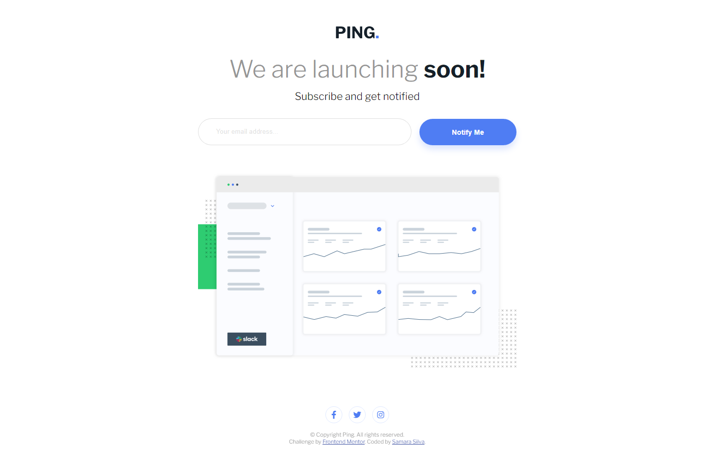
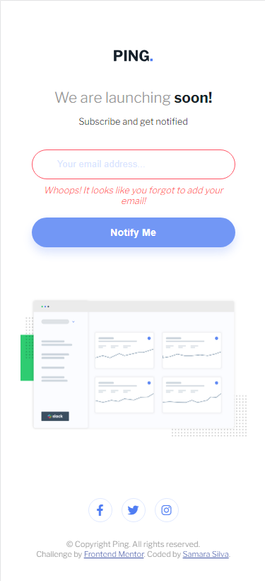

# Frontend Mentor - Ping coming soon page solution

This is a solution to the [Ping coming soon page challenge on Frontend Mentor](https://www.frontendmentor.io/challenges/ping-single-column-coming-soon-page-5cadd051fec04111f7b848da). Frontend Mentor challenges help you improve your coding skills by building realistic projects. 

## Table of contents

- [Overview](#overview)
  - [The challenge](#the-challenge)
  - [Screenshot](#screenshot)
  - [Links](#links)
- [My process](#my-process)
  - [Built with](#built-with)
  - [What I learned](#what-i-learned)
  - [Continued development](#continued-development)
  - [Useful resources](#useful-resources)
- [Author](#author)

## Overview

In this README I go over my process of development for this challenge, the things I learned and the tools I used trying to get my page as close to the design as possible.

### The challenge

Users should be able to:

- View the optimal layout for the site depending on their device's screen size
- See hover states for all interactive elements on the page
- Submit their email address using an `input` field
- Receive an error message when the `form` is submitted if:
	- The `input` field is empty. The message for this error should say *"Whoops! It looks like you forgot to add your email"*
	- The email address is not formatted correctly (i.e. a correct email address should have this structure: `name@host.tld`). The message for this error should say *"Please provide a valid email address"*

### Screenshot




### Links

- Solution URL: [Solution](https://www.frontendmentor.io/solutions/mobilefirst-solution-using-css-grid-flexbox-css-variables-1yRpKwko_o)
- Live Site URL: [Live Site](https://samarasilva18.github.io/ping-coming-soon-page)

## My process
1. I decided to tackle this project with a mobile-first workflow!
2. I structured the HTML divs, images, buttons, paragraphs, spans, and so on.
3. Then I stylized the page from top down. First the body and the main component, then the logo, the title, the paragraphs, the input and button, the hero image and the social media buttons.
4. I picked Font Awesome for the social media icons.
5. I made the active :hover state on the buttons.
6. I used the @media functionality to create the alternate CSS for desktop users. I had to fight with the grid functionality for a while but I think I understand it better now! It came out nicely I feel.
7. I created the repository in Github.
8. I wrote the sendButton Javascript code to make the functionality for all the error and success messages.
9. I wrote the README.
10. I uploaded the project.

### Built with

- CSS custom properties
- Flexbox
- CSS Grid
- Mobile-first workflow

### What I learned

I expanded on my use of grids, which was a nice challenge! I previously had only made a very simple grid so to make something that actually used both grid-column, gaps and grid-row was quite fun and also helped me understand how that feature works a bit better!

```css

    form {
        display: inline-grid;
        width: 100%;
        align-items: center;
        column-gap: 1rem;
    }

    input {
        grid-column-start: 1;
        grid-column-end: 3;
        height: 1.7rem;
    }

    #message {
        grid-row-start: 2;
        grid-column-start: 1;
        grid-column-end: 3;
    }

    button {
        grid-row-start: 1;
        grid-row-end: 1;
        grid-column-start: 3;
        grid-column-end: 3;
        height: 3.4rem;
        margin-top: 0;
        margin-bottom: 0.3rem;
    }
```
I liked the whole Javascript code, but this function is one of the most important ones, and it's one of my favorites!
```js
function showMessage(input, message, type) {
	// get the small element and set the message
	const msg = input.parentNode.querySelector("small");
    msg.innerText = message;
    msg.style.display = "inline";
	// update the class for the input
	input.className = type ? "success" : "error";
	return type;
}
```

### Continued development

This challenge took a while, I got caught up with other things and couldn't focus on it as much as I wanted to. I'm hoping that I'll be able to actually sit down and do the next challenge quicker and with better focus! I want to be able to write Javascript quicker and better, and I want to learn new technologies such as PHP as well. Once I'm able to start my next challenge, I think that's what I'm going to tackle!

### Useful resources

- [How to make a Javascript Form](https://www.javascripttutorial.net/javascript-dom/javascript-form/) - This is an amazing tutorial that helped me make the form I used in the solution! Especially the Javascript parts were really helpful!
- [CSS Grid Layout and positioned items](https://blogs.igalia.com/mrego/2016/05/27/css-grid-layout-and-positioned-items/) - This article helped me figure out how to use grid rows and better place elements in a grid!

## Author

- Frontend Mentor - [@samarasilva18](https://www.frontendmentor.io/profile/samarasilva18)
- Github - [samarasilva18](https://github.com/samarasilva18)